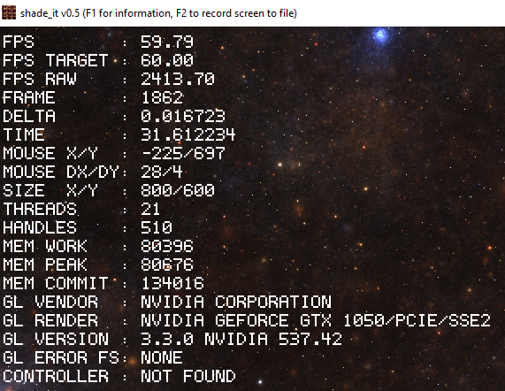
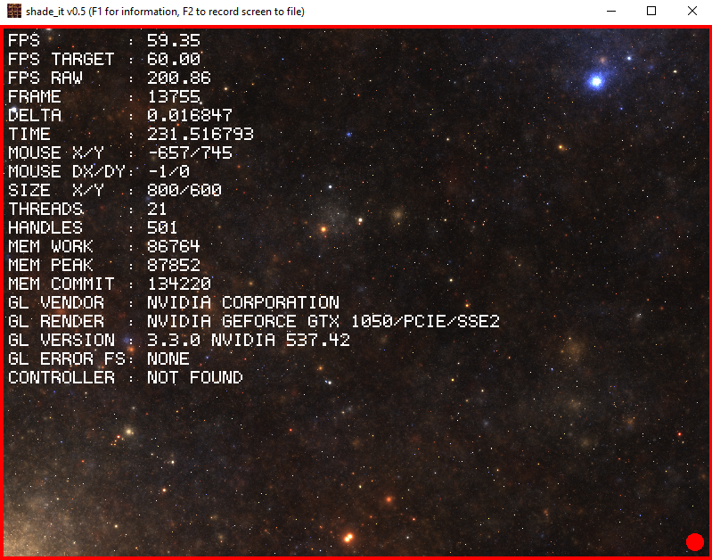
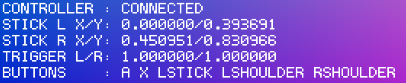

# shade_it
Live OpenGL shader coding playground written in C89, nostdlib in a single file and tiny executable (~28kb).

It allows you to **live edit GLSL** fragment **shaders** and automatically displays the changes.

## Watch the demo video
https://github.com/user-attachments/assets/ac3f5131-83a1-4043-a2ae-b103240e10bc

> [!WARNING]
> THIS PROJECT IS A WORK IN PROGRESS! ANYTHING CAN CHANGE AT ANY MOMENT WITHOUT ANY NOTICE! USE THIS PROJECT AT YOUR OWN RISK!

## Download the executable
<p align="center">
  <a href="https://github.com/nickscha/shade_it/releases/latest/download/win32_shade_it_x64.exe">
    
  </a>
  <a href="https://github.com/nickscha/shade_it/releases/latest/download/win32_shade_it_arm.exe">
    
  </a>
  <a href="https://github.com/nickscha/shade_it/releases">
    
  </a>
  <a href="https://github.com/nickscha/shade_it/releases">
    
  </a>
  <a href="https://opensource.org/licenses/MIT">
    
  </a>
  
  
</p>

## Features
- **Hot GLSL Shader reloading** - Saved changes to the GLSL file will be immediatly visible
- **Minimal binary size** — around **28kb** binary
- **Zero dependencies** — own win32 layer implementation, own OpenGL context creation
- **Debug UI** - Press **F1** to see performance metrics and GLSL compilation errors/logs
- **Screen Recording** - Press **F2** to start/stop recording the screen to a raw video file
- **Fullscreen Support** - Press **F9** for borderless. Press **F11** for classic fullscreen mode
- **XInput Gamepad Support** - Full XInput compatible gamepad/controller support in shaders
- **C89 compliant** — portable and legacy-friendly  
- **nostdlib** — no dependency on the C Standard Library
- **no memory allocation** — There is **no memory allocation** by the tool itself. It only uses the memory Windows is acquiring for the OpenGL Framebuffers, ...
- **Strict compilation** — built with aggressive warnings & safety checks  

## Quick Start

### Download Windows Executable (Prebuilt)

Download the latest Windows executable for **X64** or **ARM** from the **Latest Release**:
- https://github.com/nickscha/shade_it/releases/latest

### Building From Source

Clone the repository and build manually.
Either GCC or Clang is required to run the build script.

```bash
git clone https://github.com/nickscha/shade_it.git
cd shade_it
win32_shade_it_build.bat
```

You can now run the `win32_shade_it.exe` program.

### Running the program

> [!IMPORTANT]
> If you have donwloaded the release executeable depending on your platform use `win32_shade_it_x64.exe` or `win32_shade_it_arm.exe`

```bat
REM This expects a file named "shade_it.fs" to be present
win32_shade_it_x64.exe

REM Alternativly you can define your own fragment shader file
win32_shade_it_x64.exe examples\shade_it_star_nest.fs
```

While **running** you can **edit** and save the fragment shader source file and shade_it will immediatly **hot-reload** the code.

### GLSL Fragment Shader Template

If you want to create your own **GLSL fragment shader from scratch** you can use this **template** providing all uniforms `shade_it` hands over to the fragment shader:

```glsl
#version 330 core

out vec4 FragColor;

/* Uniforms provided */
uniform vec3  iResolution;   // viewport width and height
uniform float iTime;         // time elapsed in seconds
uniform float iTimeDelta;    // render time in seconds
uniform int   iFrame;        // total frame counter
uniform float iFrameRate;    // current frames per second
uniform vec4  iMouse;        // mouse position (x,y)
uniform vec4  iTextureInfo;  // texture width, height, cell width, cell height
uniform sampler2D iTexture;  // texture slot
uniform vec4 iController[2]; // full controller state

/* DEMO: Render gradient colors accross the entire screen */
void mainImage(out vec4 outColor, in vec2 fragCoord)
{
  vec2 uv = fragCoord / iResolution.xy;
  float t = iTime;
  outColor = vec4(uv, 0.5 + 0.5 * sin(t), 1.0);
}

void main()
{
  vec2 fragCoord = gl_FragCoord.xy;
  mainImage(FragColor, fragCoord);
}
```

Under the **examples** folder you can find different kinds of fragment shaders for inspiration that you can run directly.

### Log File

When the application is started it will write a log file named **shade_it.log**.
Beside the Debug UI you can also find here GLSL compilation errors if a shader is invalid.

If you encounter a problem/bug please attach this log file to the issue.

### Show Debug UI (F1)

Press **F1** to show/hide the debug information, performance metrics and GLSL compilation errors/logs.

<a href="https://github.com/nickscha/shade_it"></a>

### Screen Recording (F2)

Press **F2** to start/stop recording the screen to a RAW video file.

The file created is named according to the screen size and target fps:
- Format: shade_it_capture_<window_width>x<window_height>_<target_frames_per_second>.raw
- Example: **shade_it_capture_800x600_60.raw** 

> [!WARNING]
> Since it is a RAW video output the size of the **file size can be huge**.

<a href="https://github.com/nickscha/shade_it"></a>

After the recording has been stopped you can use a tool like **FFMPEG** or similar to **convert** it to a **video** format.

Example of creating a **MP4** video using **FFMPEG**:

```bat
ffmpeg -f rawvideo -pix_fmt rgb24 -s 800x600 -r 60 -i shade_it_capture_800x600_60.raw -vf vflip out.mp4
```

Note that the **size** (here 800x600) and the **FPS** (here 60) **have to match** with your recorded data.

### Borderless Mode (F9)

You can enter/leave the borderless window mode by pressing **F9**.

### Fullscreen Mode (F11)

You can enter/leave the "classic" fullscreen window mode by pressing **F11**.

### Pausing Shader (P)

If you want to freeze/pause the current shader display you can press **P**.

### Reset Time (R)

If you want to reset the current elapsed time (iTime) and processed frames (iFrame) you can press **R**.

### XInput Controller Support

SHADE_IT supports XInput compatible controllers.
When connected you can also see button presses, thumbstick and trigger values in the **Debug UI** (F1).

<a href="https://github.com/nickscha/shade_it"></a>

The controller state is packed into a `uniform vec4 iController[2]` for shaders.

#### Watch the demo video

https://github.com/user-attachments/assets/5d5d7a17-3adb-415b-824e-edeaeb37b651

#### Uniform `iController` Mapping

| Vector Index | Component | GLSL Access | Type | Description | Range |
| :--- | :--- | :--- | :--- | :--- | :--- |
| **`iController[0]`** | `.x` | `.x` | `float` | **Left Stick X** | `[-1.0, 1.0]` |
| | `.y` | `.y` | `float` | **Left Stick Y** | `[-1.0, 1.0]` |
| | `.z` | `.z` | `float` | **Right Stick X** | `[-1.0, 1.0]` |
| | `.w` | `.w` | `float` | **Right Stick Y** | `[-1.0, 1.0]` |
| **`iController[1]`** | `.x` | `.x` | `float` | **Trigger Left** | `[0.0, 1.0]` |
| | `.y` | `.y` | `float` | **Trigger Right** | `[0.0, 1.0]` |
| | `.z` | `.z` | `uint`* | **Packed Buttons** | *See Bitmask Table* |
| | `.w` | `.w` | `N/A` | *Padding* | *Unused* |

#### Packed Button Bitmask Table (`iController[1].z`)

Use the bitwise AND operator `&` with `(1u << Index)` to check for button states.

| Bit Index | Button / Input | Description |
| :--- | :--- | :--- |
| **0** | `BUTTON_A` | |
| **1** | `BUTTON_B` | |
| **2** | `BUTTON_X` | |
| **3** | `BUTTON_Y` | |
| **4** | `SHOULDER_L` | Left Bumper |
| **5** | `SHOULDER_R` | Right Bumper |
| **6** | `TRIGGER_L` | Digital Threshold (Is Pulled) |
| **7** | `TRIGGER_R` | Digital Threshold (Is Pulled) |
| **8** | `DPAD_UP` | |
| **9** | `DPAD_DOWN` | |
| **10** | `DPAD_LEFT` | |
| **11** | `DPAD_RIGHT` | |
| **12** | `STICK_L_CLICK`| Left Thumbstick Button |
| **13** | `STICK_R_CLICK`| Right Thumbstick Button |
| **14** | `START` | |
| **15** | `BACK` | |
| **16** | `CONNECTED` | `1` if controller is active |

> [!IMPORTANT]
> `iController[1].z` contains raw bit data. In your shader, you **must** use `floatBitsToUint()` to decode the button states correctly.

#### Shader example for `iController` usage

A basic controller shader example can be found in **examples/shade_it_controller.fs**.

Here is a minimal example of how to access the data:

```glsl
bool controller_button_down(uint bit_index)
{
    uint bits = floatBitsToUint(iController[1].z);
    return (bits & (1u << bit_index)) != 0u;
}

void mainImage(out vec4 outColor, in vec2 fragCoord)
{
    // Access Analog Sticks
    vec2 left_stick  = iController[0].xy;
    vec2 right_stick = iController[0].zw;
    
    // Access Triggers
    float left_trigger  = iController[1].x;
    float right_trigger = iController[1].y;

    // Access Buttons
    bool btn_a = controller_button_down(0u);
    bool btn_b = controller_button_down(1u);
    bool btn_x = controller_button_down(2u);
    bool btn_y = controller_button_down(3u);
    bool dpad_up = controller_button_down(8u);

    // ...
}
```

## Roadmap

For the next release of **SHADE_IT** the following features are planend.

### v0.7 Features (not released yet)
- [x] Efficient XInput state retrieval using HID notifications (only check connection state when a device is connected or disconnected from the machine). This improves performance since XInputGetState for disconnected or invalid IDs can cause full BUS scan and is quiet slow. With this change we only query XInputState if a device is connected/disconnected.
- [x] win32 entry name change as suggested by @skeeto
- [ ] Optimize stack usage with arena as suggested by @skeeto
- [ ] Improved OpenGL functions loader. Some GPU Drivers can return from wglGetProcAddress: (void *)0x1, (void *)0x2, (void *)0x3, (void *)-1 instead of a NULL pointer!
- [ ] Use Uniform Buffer Objects (UBO) for better performance rather than single uniforms if the GPU driver allows it

### v0.6 Features
- [x] Win32 ARM release build
- [x] Fullscreen support for both windowed and borderless (F11 and F9)
- [x] Reset Shader iTime and iFrame (R)
- [x] Full XInput Controller support (Retrieving logic implemented in v0.5 but not yet optimized and passed to shaders)

## "nostdlib" Motivation & Purpose

nostdlib is a lightweight, minimalistic approach to C development that removes dependencies on the standard library. The motivation behind this project is to provide developers with greater control over their code by eliminating unnecessary overhead, reducing binary size, and enabling deployment in resource-constrained environments.

Many modern development environments rely heavily on the standard library, which, while convenient, introduces unnecessary bloat, security risks, and unpredictable dependencies. nostdlib aims to give developers fine-grained control over memory management, execution flow, and system calls by working directly with the underlying platform.

### Benefits

#### Minimal overhead
By removing the standard library, nostdlib significantly reduces runtime overhead, allowing for faster execution and smaller binary sizes.

#### Increased security
Standard libraries often include unnecessary functions that increase the attack surface of an application. nostdlib mitigates security risks by removing unused and potentially vulnerable components.

#### Reduced binary size
Without linking to the standard library, binaries are smaller, making them ideal for embedded systems, bootloaders, and operating systems where storage is limited.

#### Enhanced performance
Direct control over system calls and memory management leads to performance gains by eliminating abstraction layers imposed by standard libraries.

#### Better portability
By relying only on fundamental system interfaces, nostdlib allows for easier porting across different platforms without worrying about standard library availability.
