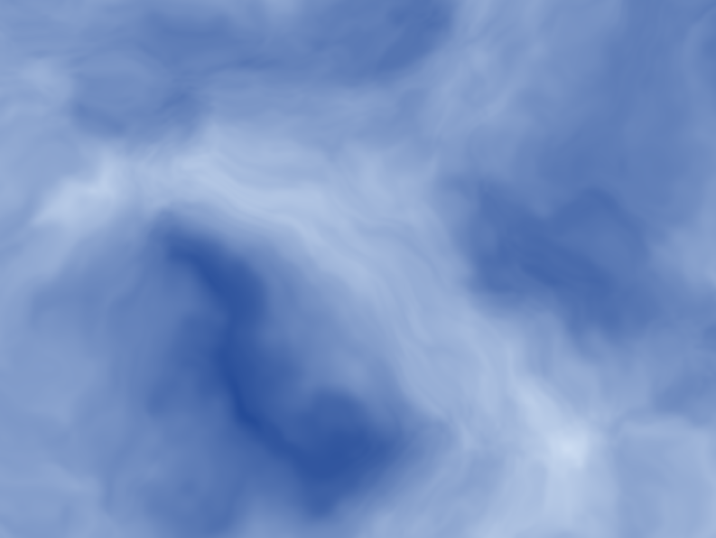
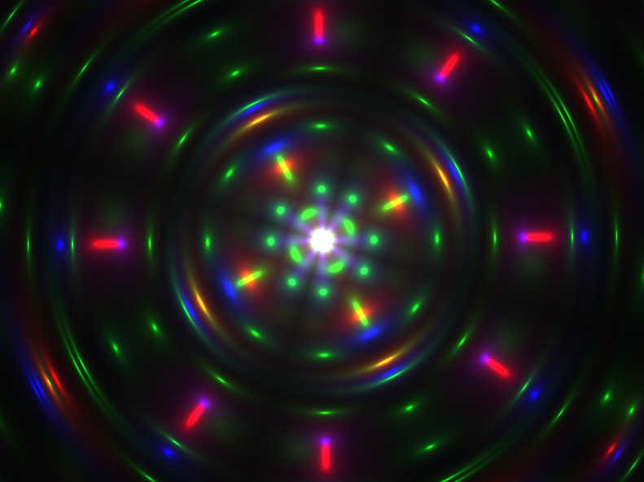

# shade_it
A C89 standard compliant, single file, nostdlib (no C Standard Library) OpenGL Shader Playground (SHADE_IT).

<p align="center">
<a href="https://github.com/nickscha/shade_it/examples"></a>
<a href="https://github.com/nickscha/shade_it/examples"></a>
<a href="https://github.com/nickscha/shade_it/examples"></a>
</p>

> [!WARNING]
> THIS PROJECT IS A WORK IN PROGRESS! ANYTHING CAN CHANGE AT ANY MOMENT WITHOUT ANY NOTICE! USE THIS PROJECT AT YOUR OWN RISK!

<p align="center">
  <a href="https://github.com/nickscha/shade_it/releases">
    
  </a>
  <a href="https://github.com/nickscha/shade_it/releases">
    
  </a>
  <a href="https://opensource.org/licenses/MIT">
    
  </a>
  
  
</p>

## **Features**
- **C89 compliant** — portable and legacy-friendly  
- **nostdlib** — no dependency on the C Standard Library
- **Zero dependencies** — own win32 layer implementation, own OpenGL context creation
- **Minimal binary size** — around 9kb binary
- **Strict compilation** — built with aggressive warnings & safety checks  
- **Hot GLSL Shader reloading** - Saved changes to the GLSL file will be immediatly visible

## Quick Start (User)

Download the latest Windows executable from the **Actions → Artifacts** page:
- https://github.com/nickscha/shade_it/actions

Extract the archive and run `win32_shade_it.exe`.  

You can run the program like this:

```bat
REM This expects a file named "shade_it.fs" to be present
win32_shade_it.exe

REM Alternativly you can define your own fragment shader file
win32_shade_it.exe my_custom_shader.fs
```

If you want to create your own GLSL fragment shader from scratch you can use this template providing all uniforms `shade_it` hands over to the fragment shader:

```glsl
#version 330 core

out vec4 FragColor;

/* Uniforms provided */
uniform vec3  iResolution;
uniform float iTime;
uniform float iTimeDelta;
uniform int   iFrame;
uniform float iFrameRate;

void mainImage(out vec4 outColor, in vec2 fragCoord)
{
  vec2 uv = fragCoord / iResolution.xy;
  float t = iTime;
  outColor = vec4(uv, 0.5 + 0.5 * sin(t), 1.0);
}

void main()
{
  vec2 fragCoord = gl_FragCoord.xy;
  mainImage(FragColor, fragCoord);
}
```

## Quick Start (Developers)

Building this single source file program can be done by calling the `win32_shade_it_build.bat` script.

## "nostdlib" Motivation & Purpose

nostdlib is a lightweight, minimalistic approach to C development that removes dependencies on the standard library. The motivation behind this project is to provide developers with greater control over their code by eliminating unnecessary overhead, reducing binary size, and enabling deployment in resource-constrained environments.

Many modern development environments rely heavily on the standard library, which, while convenient, introduces unnecessary bloat, security risks, and unpredictable dependencies. nostdlib aims to give developers fine-grained control over memory management, execution flow, and system calls by working directly with the underlying platform.

### Benefits

#### Minimal overhead
By removing the standard library, nostdlib significantly reduces runtime overhead, allowing for faster execution and smaller binary sizes.

#### Increased security
Standard libraries often include unnecessary functions that increase the attack surface of an application. nostdlib mitigates security risks by removing unused and potentially vulnerable components.

#### Reduced binary size
Without linking to the standard library, binaries are smaller, making them ideal for embedded systems, bootloaders, and operating systems where storage is limited.

#### Enhanced performance
Direct control over system calls and memory management leads to performance gains by eliminating abstraction layers imposed by standard libraries.

#### Better portability
By relying only on fundamental system interfaces, nostdlib allows for easier porting across different platforms without worrying about standard library availability.
